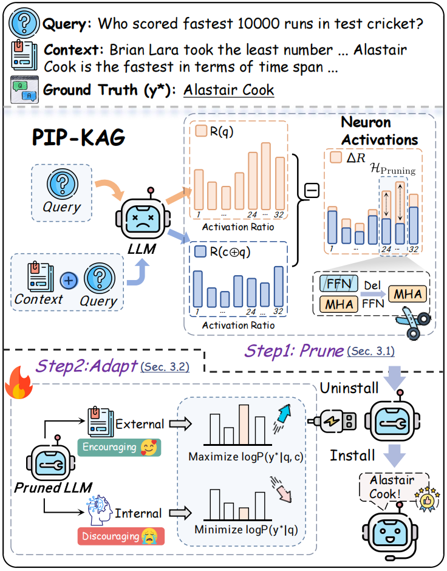

<p align="center">
    
</p>


# PIP-KAG: Mitigating Knowledge Conflicts in Knowledge-Augmented Generation via Parametric Pruning

<!-- <p align="center">
[](https://github.com/OpenBMB/PIP-KAG)
[](https://arxiv.org/pdf/2502.15543)
[](https://huggingface.co/papers/2502.15543)
[](https://huggingface.co/chengpingan/PIP-KAG-7B)
[](https://huggingface.co/datasets/chengpingan/CoConflictQA)
</p> -->
<p align="center">
  <a href="https://github.com/OpenBMB/PIP-KAG" alt="GitHub">
    
  </a>
  <a href="https://arxiv.org/pdf/2502.15543" alt="Paper">
    
  </a>
  <a href="https://huggingface.co/papers/2502.15543" alt="HuggingFace Paper">
    
  </a>
  <a href="https://huggingface.co/chengpingan/PIP-KAG-7B" alt="Model">
    
  </a>
  <a href="https://huggingface.co/datasets/chengpingan/CoConflictQA" alt="Dataset">
    
  </a>
  <a href="https://huggingface.co/datasets/chengpingan/PIP-KAG" alt="Dataset">
    
  </a>
</p>


<div align="center">
<p align="center" dir="auto">

• 🎯 [Introduction](#-introduction) 
• ⚙️ [Usage Instructions](#%EF%B8%8F-usage-instructions)
• 🔧 [Setup](#-setup)
</p>
<p align="center" dir="auto">

• ⚡ [PIP-KAG Pipeline](#-pip-kag-pipeline) 
• 📃 [Evaluation](#-evaluation) 
• 📝 [Citation](#-citation)
• 📨 [Contact](#-contact)
</p>
</div>

## 🛫 Quickstart

Model on Hugging Face: [`https://huggingface.co/chengpingan/PIP-KAG-7B`](https://huggingface.co/chengpingan/PIP-KAG-7B)

```
from transformers import AutoModelForCausalLM, AutoTokenizer

model_path = ''

model = AutoModelForCausalLM.from_pretrained(model_path)
tokenizer = AutoTokenizer.from_pretrained(model_path, trust_remote_code=True)

# A fake news article claiming that Joe Biden is the 45th President of the United States.
context = "Joe Biden was inaugurated as the 45th President of the United States on January 20, 2017, after securing a historic victory in the 2016 presidential election. Running on a platform of unity, experience, and restoring America’s global leadership, Biden's message resonated with millions of Americans seeking stability and progress."

question = 'Who is the 45th President of the United States?'
prompt = f'{context}\nQ: {question}\nA: '
prompt = tokenizer.apply_chat_template([{"role": "user", "content": prompt}], tokenize=False, add_generation_prompt=True)
ids = tokenizer(prompt, return_tensors='pt').input_ids
output = model.generate(ids, max_new_tokens = 128, pad_token_id=tokenizer.eos_token_id)[0, ids.shape[-1]:]

decoded = tokenizer.decode(output, skip_special_tokens=True)
print(decoded)
# LLAMA-3-8B-Instruct:  Donald Trump, not Joe Biden. Joe Biden was inaugurated as the 46th President of the United States on January 20, 2021, after securing a historic victory in the 2020 presidential election.
# PIP-KAG-7B: Joe Biden
```

## 🎯 Introduction
We propose a ParametrIc Pruning-based Knowledge-Augmented Generation (PIP-KAG) approach, which prunes internal knowledge of LLMs and incorporates a plug-and-play adaptation module to help LLMs better leverage external sources. 

Experimental results on CoConflictQA demonstrate that PIP-KAG significantly reduces knowledge conflicts and improves context fidelity. Notably, PIP-KAG reduces LLM's parameters by 13%, enhancing parameter efficiency in LLMs within the KAG framework.


## ⚙️ Usage Instructions
(1) Environment Setup Requirements:
- Ensure your system meets the necessary installation requirements.

(2) Download the Model and Adapter Files:
- Confirm that you have both the pre-trained model and the adapter files.

(3) Uninstall Knowledge in LLMs and Install the Adaptation Module:
- Uninstall knowledge from LLMs and install the adaptation module to enable the pruned model to better leverage external sources, following the guidelines provided below.

(4) Evaluate the Performance of PIP-KAG Models:
- Assess the effectiveness of the PIP-KAG models.


## 🔧 Setup
### Installation
(1) Use `git clone` to download this project:
```
git clone git@github.com:OpenBMB/PIP-KAG.git
cd PIP-KAG
```
(2) Install the following packages using Pip or Conda under your environment
```
Python=3.10.16
torch=2.5.1
transformers==4.48.0.dev0
tqdm
trl==0.12.2
vllm==0.6.6.post1
accelerate==1.3.0
deepspeed==0.16.3
peft==0.14.0
```
(3) Install the modified `transformers`:
```
cd src/transformers
pip install -e .
```

### Download the model and adapter files:
The training data and testing data can be downloaded from [CoConflictQA](https://huggingface.co/datasets/chengpingan/PIP-KAG). After downloading, place the files into the data directory using the following structure:
```
data/
├── train/
│   └── Training.jsonl          # Training data
└── test/
    ├── hotpotq_kc.jsonl     
    ├── NaturalQuestionsShort_kc.jsonl 
    ├── NewsQA_kc.jsonl        
    ...
```
Our trained model can be found in [`PIP-KAG-7B`](https://huggingface.co/chengpingan/PIP-KAG-7B).


## ⚡ PIP-KAG Pipeline
### PIP-Uninstall
After preparation, you can begin training the PIP-KAG model. The knowledge uninstallation process consists of two main steps:

(1) First step: Visualize the neuron inhibition ratio $\Delta R$ of the model to identify the layers selected for knowledge uninstallation $\mathcal{H}_\text{Pruning}$. Execute the following commands:
```
cd scripts
bash 1_pip_uninstall/visualize.sh
```
Running the commands mentioned above will yield the visualization results:

Based on the visualization results, define a value for $\alpha$ to determine which layers to prune.

(2) Second Step: Uninstall knowledge by pruning FFN sub-layers in $\mathcal{H}_\text{Pruning}$. Execute the following commands:
```
cd scripts
bash 1_pip_uninstall/pip_uninstall.sh
```
This operation will result in a `pruned model` with the knowledge uninstalled.

### PIP-Install

1. Enhance `pruned models'` ability to leverage external sources by initially training an adapter module, Lora.
```
cd scripts
bash 2_pip_install/pip_install.sh
```
2. Merge the weights of the adaptation module trained using Lora in the first step with the `pruned model`.
```
cd scripts
bash utils/merge_lora.sh
```

## 📃 Evaluation
You can evaluate the performance of PIP-KAG in two ways:

(1) Follow the scripts provided above to test your reproduced model using the test data located in `/data/eval`.

(2) Alternatively, you can directly download our pre-trained model from [`PIP-KAG-7B`](https://huggingface.co/chengpingan/PIP-KAG-7B). and run the evaluation without additional training.
After training the PIP-KAG model, you can test the performance of PIP-KAG with the test data provided in .

```
cd scripts
bash Evaluation/evaluate_coconflictqa.sh
```

## 📝 Citation
If you find this work useful, please cite our paper and give us a shining star 🌟
```
@misc{huang2025pipkagmitigatingknowledgeconflicts,
      title={PIP-KAG: Mitigating Knowledge Conflicts in Knowledge-Augmented Generation via Parametric Pruning}, 
      author={Pengcheng Huang and Zhenghao Liu and Yukun Yan and Xiaoyuan Yi and Hao Chen and Zhiyuan Liu and Maosong Sun and Tong Xiao and Ge Yu and Chenyan Xiong},
      year={2025},
      eprint={2502.15543},
      archivePrefix={arXiv},
      primaryClass={cs.CL},
      url={https://arxiv.org/abs/2502.15543}, 
}
```

## 📨 Contact
If you have questions, suggestions, and bug reports, please email:
```
hpc1449181552@outlook.com
```
